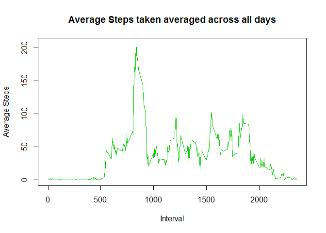
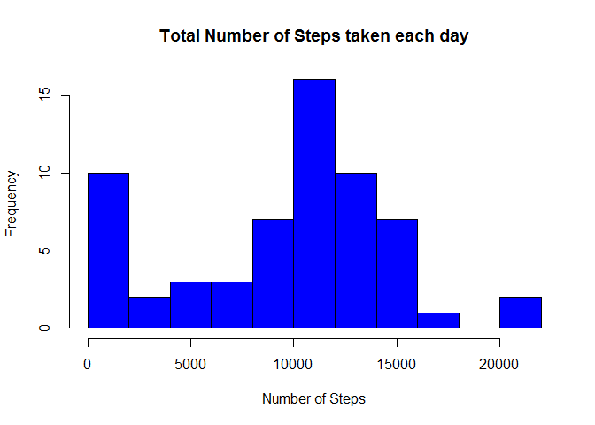
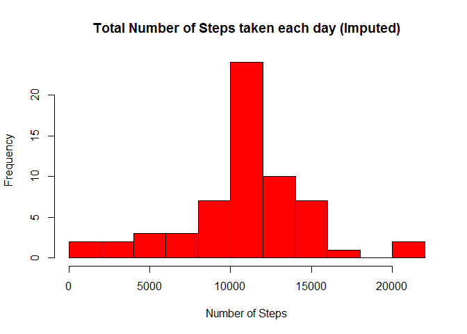
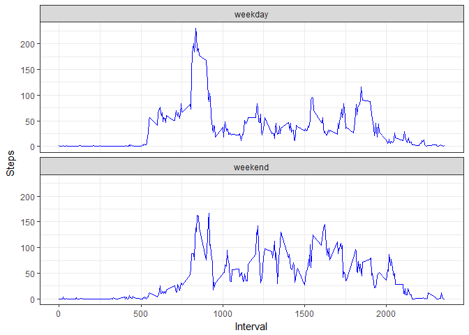

# Reproducible Research: Peer Assessment 1
This analysis was executed using:
-version 1.0.136 of RStudio
-version 3.3.2 of R


```r
library(knitr)
library(ggplot2)
library(dplyr)
```

```
## 
## Attaching package: 'dplyr'
```

```
## The following objects are masked from 'package:stats':
## 
##     filter, lag
```

```
## The following objects are masked from 'package:base':
## 
##     intersect, setdiff, setequal, union
```
## Loading and preprocessing the data
1. Load the data (i.e. read.csv())
2. Process/transform the data (if necessary) into a format suitable for your analysis

```r
act_data <- read.csv(unz("activity.zip","activity.csv"), header=T)
act_data$date <- as.Date(act_data$date)
summary(act_data)
```

```
##      steps             date               interval     
##  Min.   :  0.00   Min.   :2012-10-01   Min.   :   0.0  
##  1st Qu.:  0.00   1st Qu.:2012-10-16   1st Qu.: 588.8  
##  Median :  0.00   Median :2012-10-31   Median :1177.5  
##  Mean   : 37.38   Mean   :2012-10-31   Mean   :1177.5  
##  3rd Qu.: 12.00   3rd Qu.:2012-11-15   3rd Qu.:1766.2  
##  Max.   :806.00   Max.   :2012-11-30   Max.   :2355.0  
##  NA's   :2304
```

## What is mean total number of steps taken per day?
1. Calculate the total number of steps taken per day

```r
total_steps <- aggregate(act_data$steps, by=list(act_data$date), FUN=sum, na.rm=TRUE)
names(total_steps) <- c("date", "steps")
str(total_steps)
```

```
## 'data.frame':	61 obs. of  2 variables:
##  $ date : Date, format: "2012-10-01" "2012-10-02" ...
##  $ steps: int  0 126 11352 12116 13294 15420 11015 0 12811 9900 ...
```

2. If you do not understand the difference between a histogram and a barplot, research the difference between them. 
Make a histogram of the total number of steps taken each day

```r
hist(total_steps$steps, breaks=10, col="blue", xlab="Number of Steps", ylab="Frequency", main="Histogram of the Total Number of Steps taken each day ")
```

<!-- -->

3. Calculate and report the mean and median of the total number of steps taken per day

```r
act_mean <- mean(total_steps$steps,na.rm=TRUE)
act_median <- median(total_steps$steps, na.rm=TRUE)
```
The mean total number of steps is: <b>9354</b>

The median total number of steps is: <b>10395</b>

## What is the average daily activity pattern?
1. Make a time series plot (i.e. type = "l") of the 5-minute interval (x-axis) and the average number of steps taken, averaged across all days (y-axis)

```r
int_steps <- aggregate(steps~interval,data=act_data, FUN=mean, na.rm=TRUE)
plot(steps~interval, data=int_steps, type='l', col=27, xlab="Interval", ylab="Average Steps", main="Average Steps taken averaged across all days")
```

<!-- -->

2. Which 5-minute interval, on average across all the days in the dataset, contains the maximum number of steps?

```r
max_value <- which.max(int_steps$steps)
max_int <- int_steps[max_value,]
```
The <b>835</b> interval contains the maxmium number of steps.


## Imputing missing values
Note that there are a number of days/intervals where there are missing values (coded as NA). The presence of missing days may introduce bias into some calculations or summaries of the data.

1. Calculate and report the total number of missing values in the dataset (i.e. the total number of rows with NAs)

```r
miss_val <- sum(is.na(act_data))
```
The total number of missing values in the dataset is: <b>2304</b>.

2. Devise a strategy for filling in all of the missing values in the dataset. The strategy does not need to be sophisticated. For example, you could use the mean/median for that day, or the mean for that 5-minute interval, etc.

My strategy will be to use the mean number of steps found the 5-minute interval from the first question. <b>int_steps</b>

3.Create a new dataset that is equal to the original dataset but with the missing data filled in.

```r
# preserve original data by creating a new dataset
filled_data <- act_data

# for each NA found, replace the steps with the mean found per interval from the first question.
for (i in 1:nrow(filled_data)) {
  if (is.na(filled_data$steps[i])){
    int_value <- filled_data$interval[i]             #get the interval value that has NA for steps
    row_id <- which(int_steps$interval == int_value) #find which record that relates to
    filled_data$steps[i] <- int_steps$steps[row_id]  #get the mean value for the step
  }
}
summary(filled_data)
```

```
##      steps             date               interval     
##  Min.   :  0.00   Min.   :2012-10-01   Min.   :   0.0  
##  1st Qu.:  0.00   1st Qu.:2012-10-16   1st Qu.: 588.8  
##  Median :  0.00   Median :2012-10-31   Median :1177.5  
##  Mean   : 37.38   Mean   :2012-10-31   Mean   :1177.5  
##  3rd Qu.: 27.00   3rd Qu.:2012-11-15   3rd Qu.:1766.2  
##  Max.   :806.00   Max.   :2012-11-30   Max.   :2355.0
```

4.Make a histogram of the total number of steps taken each day and Calculate and report the mean and median total number of steps taken per day. Do these values differ from the estimates from the first part of the assignment? What is the impact of imputing missing data on the estimates of the total daily number of steps?

```r
total_filled <- aggregate(steps~date,data=filled_data, FUN=sum)
total_filled$date <- as.Date(total_filled$date)

hist(total_steps$steps, breaks=10, col="blue", xlab="Number of Steps", ylab="Frequency", main="Total Number of Steps taken each day")
```

<!-- -->

```r
hist(total_filled$steps, breaks=10, col="red", xlab="Number of Steps", ylab="Frequency", main="Total Number of Steps taken each day (Imputed)")
```

<!-- -->

```r
filled_mean <- mean(total_filled$steps)
filled_median <- median(total_filled$steps)
```
The mean total number of steps is: <b>10766</b> (previously <b>9354</b>)

The median total number of steps is: <b>10766</b> (previously <b>10395</b>)

The values for the mean and median increased due to values that were previously NA but now set to the mean of the 5-minute interval data.
This is seen in the histogram by the reduction in frequency of 0 steps and increase around the 10000 step marker.

## Are there differences in activity patterns between weekdays and weekends?
For this part the weekdays() function may be of some help here. Use the dataset with the filled-in missing values for this part.

1. Create a new factor variable in the dataset with two levels - "weekday" and "weekend" indicating whether a given date is a weekday or weekend day.

```r
type_of_day <- function(theDate){
  day_of_week <- weekdays(theDate)
  if (day_of_week %in% c("Saturday", "Sunday"))
    return("weekend") 
  else
    return("weekday")
}

#filled_data$day_of_week <- weekdays(filled_data$date) #Just to sanity check the result is correct.
filled_data$day_type <- as.factor(sapply(filled_data$date, FUN=type_of_day))

str(filled_data)
```

```
## 'data.frame':	17568 obs. of  4 variables:
##  $ steps   : num  1.717 0.3396 0.1321 0.1509 0.0755 ...
##  $ date    : Date, format: "2012-10-01" "2012-10-01" ...
##  $ interval: int  0 5 10 15 20 25 30 35 40 45 ...
##  $ day_type: Factor w/ 2 levels "weekday","weekend": 1 1 1 1 1 1 1 1 1 1 ...
```
2. Make a panel plot containing a time series plot (i.e. type = "l") of the 5-minute interval (x-axis) and the average number of steps taken, averaged across all weekday days or weekend days (y-axis). See the README file in the GitHub repository to see an example of what this plot should look like using simulated data.

```r
mean_data <- aggregate(steps~day_type:interval,data=filled_data, FUN=mean)

ggplot(mean_data, aes(x=interval, y=steps))+
  geom_line(color="blue") + 
  facet_wrap(~day_type, nrow=2, ncol=1) +
  labs(x="Interval", y="Steps", main="Average Steps taken in 5-minute interval seperate by weekday and weekend")+
  theme_bw()
```

<!-- -->
